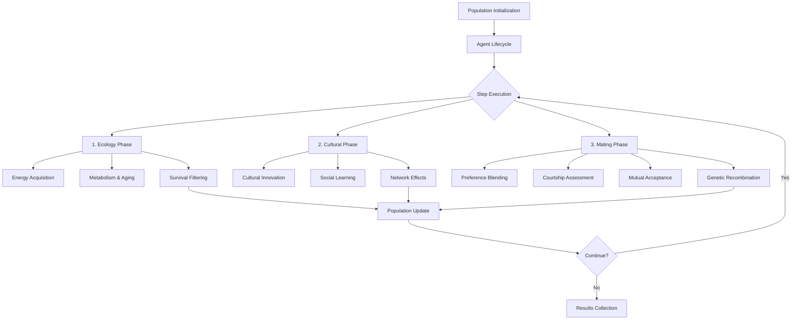
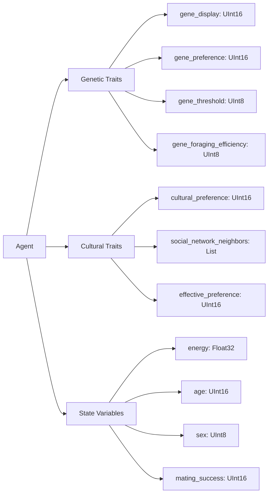

# LoveBug: Agent-Based Evolutionary Simulation 🐞💘

[](https://github.com/adamamer20/lovebug/actions/workflows/ci.yml)
[](https://adamamer20.github.io/lovebug/)
[](https://pypi.org/project/lovebug/)
[](https://opensource.org/licenses/MIT)

**A high-performance agent-based model for studying sexual selection and cultural-genetic coevolution. Built with Mesa-Frames and Polars for vectorized operations on large populations (10k+ individuals).**

---

## 📜 Project Overview

LoveBug is a research-oriented computational laboratory for investigating the evolution of mate choice through multiple inheritance mechanisms. The model integrates genetic inheritance, social learning, perceptual constraints, and cultural transmission within a unified framework designed to test theoretical predictions and replicate empirical findings from evolutionary biology literature.

### Key Research Questions

The model addresses fundamental questions in sexual selection and cultural evolution:

- **When do genetic vs. cultural mechanisms dominate mate choice evolution?**
- **How do social learning and cultural transmission interact with genetic inheritance?**
- **What role do perceptual constraints play in trait-preference coevolution?**
- **Can cultural transmission functionally substitute for genetic linkage in sexual selection?**

---

## ✨ Key Features

### Performance & Architecture
* **Vectorized core**: All agents stored in Polars DataFrames; handles 100k+ individuals efficiently
* **Unlinked gene architecture**: 32-bit genome encoding display traits, mate preferences, and behavioral thresholds
* **Mesa-Frames compatibility**: Full integration with Mesa's agent-based modeling framework

### Evolutionary Mechanisms
* **Two-layer evolution**: Genetic inheritance (Layer 1) + cultural learning (Layer 2)
* **Multiple learning strategies**: Mate-choice copying, conformist bias, prestige bias
* **Perceptual realism**: Noisy sensory channels and detection thresholds
* **Network effects**: Configurable social network topologies for cultural transmission

### Research Validation
* **Literature replications**: Quantitative reproduction of landmark empirical studies
* **Theory validation**: Recovers Fisher-Lande-Kirkpatrick dynamics without genetic linkage
* **Parameter exploration**: Latin Hypercube Sampling across genetic-cultural parameter space

---

## 🚀 Quick Start

### Installation

```bash
git clone https://github.com/adamamer20/lovebug.git
cd lovebug
uv sync --all-extras
```

### Basic Usage

```python
from lovebug import LoveModel, LoveBugConfig, GeneticParams, CulturalParams, LayerConfig, SimulationParams

# Genetic-only evolution
config = LoveBugConfig(
    name="genetic_only_simulation",
    genetic=GeneticParams(
        mutation_rate=0.01,
        crossover_rate=0.7,
        h2_trait=0.8,
        h2_preference=0.8,
    ),
    cultural=CulturalParams(),
    simulation=SimulationParams(population_size=5000),
    layer=LayerConfig(genetic_enabled=True, cultural_enabled=False)
)

model = LoveModel(config=config)
model.run_model()
print(f"Final population: {len(model.agents)}")
```

### Run Research Experiments

```bash
# Complete experimental pipeline
uv run python experiments/paper_experiments.py --run-empirical --run-lhs

# Quick validation test
uv run python experiments/paper_experiments.py --quick-test

# Literature replications only
uv run python experiments/paper_experiments.py --run-empirical

# Parameter space exploration
uv run python experiments/paper_experiments.py --run-lhs --lhs-samples 100
```

---

## 🧬 Model Architecture

### Simulation Flow



### Agent Data Structure



### Agent Representation

The model implements an **unlinked multi-gene architecture** where agents possess separate, independently assorting genetic loci:

| Component | Type | Bits | Description |
|-----------|------|------|-------------|
| **Display Trait** | `gene_display` | 16-bit UInt16 | Ornamental features visible to potential mates |
| **Mate Preference** | `gene_preference` | 16-bit UInt16 | Innate attraction pattern for mate assessment |
| **Choosiness Threshold** | `gene_threshold` | 4-bit UInt8 | Behavioral selectivity in mate acceptance |
| **Foraging Efficiency** | `gene_foraging_efficiency` | 8-bit UInt8 | Survival-related foraging capability |
| **Cultural Preference** | `cultural_preference` | 16-bit UInt16 | Learned mate preference from social observation |
| **Effective Preference** | `effective_preference` | 16-bit UInt16 | Blended genetic-cultural preference (combined models) |

### Three-Phase Simulation Cycle

#### Phase 1: Ecology & Natural Selection

```python
# Density-dependent energy acquisition
density_factor = max(0.1, 1.0 - (current_pop / carrying_capacity) ** 2)
energy_gain = base_energy * density_factor * foraging_efficiency

# Display-survival trade-off
display_cost = display_bits.count() / 16.0 * display_cost_scalar
effective_foraging = (foraging_efficiency - display_cost).clip(0.1, 1.0)

# Survival filtering
survivors = agents.filter((age < max_age) & (energy > 0))
```

#### Phase 2: Cultural Evolution (if enabled)

```python
# Cultural innovation
if random() < innovation_rate:
    cultural_preference = random_16bit_pattern()

# Social learning strategies
if learning_strategy == "conformist":
    new_preference = mode(neighbor_preferences)
elif learning_strategy == "success-biased":
    new_preference = preference_of_most_successful_neighbor()
```

#### Phase 3: Mating & Reproduction

```python
# Preference blending (combined models)
effective_preference = (genetic_weight * gene_preference +
                       cultural_weight * cultural_preference)

# Hamming similarity-based mate assessment
similarity = 16 - bitcount(display_partner ⊕ effective_preference_self)
acceptance_prob = sigmoid(steepness * (similarity - threshold))

# Genetic recombination (unlinked inheritance)
offspring_display = random_choice(parent_a_display, parent_b_display)
offspring_preference = random_choice(parent_a_preference, parent_b_preference)
```

### Layer Configuration System

The model supports four evolutionary regimes through `LayerConfig`:

| Mode | Genetic Enabled | Cultural Enabled | Description |
|------|-----------------|------------------|-------------|
| **Genetic-only** | ✓ | ✗ | Pure Fisher-Lande-Kirkpatrick dynamics |
| **Cultural-only** | ✗ | ✓ | Social learning without genetic evolution |
| **Combined** | ✓ | ✓ | Synergistic genetic-cultural coevolution |
| **Validation** | ✓ | ✗ | Testing/comparison baseline |

### Performance Optimizations

#### Vectorized Operations

- **Polars DataFrames**: All agent data stored in columnar format for vectorized operations
- **Hamming similarity**: Native Rust-optimized `bitwise_count_ones()` function
- **Batch mutations**: Vectorized bit-flipping across entire population
- **Network operations**: Fully vectorized social network neighbor retrieval

#### Memory Efficiency

- **Bit-packed genomes**: Multiple traits encoded in single integers
- **Lazy evaluation**: Polars expressions evaluated only when needed
- **Zero-copy operations**: In-place DataFrame modifications where possible

### Biological Realism Features

#### Population Regulation

- **Carrying capacity**: Density-dependent resource competition
- **Energy system**: Metabolic costs, foraging efficiency, parental investment
- **Age structure**: Natural mortality and maximum lifespan limits
- **Juvenile costs**: Start-up energy requirements for offspring survival

#### Perceptual Constraints

- **Sensory noise**: Gaussian noise in mate assessment (`sigma_perception`)
- **Detection thresholds**: Minimum similarity for mate recognition (`theta_detect`)
- **Sigmoid acceptance**: Probabilistic mate choice with configurable steepness

#### Social Learning Mechanisms

- **Network topologies**: Small-world, scale-free, random network structures
- **Learning strategies**: Conformist, success-biased, condition-dependent, age-biased
- **Cultural innovation**: Spontaneous generation of novel preferences
- **Memory dynamics**: Cultural preference updating and decay

---

## 🔬 Research Experiments

### Three-Phase Experimental Protocol

#### Phase 1: Literature Replications
Validates model against established empirical findings:

- **Dugatkin (1992)**: Mate-choice copying in guppies
- **Witte et al. (2002)**: Cultural transmission of mate preferences
- **Rodd et al. (2002)**: Sensory bias driven trait evolution

#### Phase 2: Parameter Space Exploration
Systematic exploration using Latin Hypercube Sampling:

- **Genetic-only regime**: Pure Fisher-Lande-Kirkpatrick dynamics
- **Cultural-only regime**: Social learning without genetic evolution
- **Combined regime**: Synergistic genetic-cultural coevolution

#### Lande-Kirkpatrick Validation
Tests three classic sexual selection scenarios:

- **Stasis**: Moderate heritability, balanced energy → no trait-preference correlation
- **Runaway**: High heritability, abundant energy → trait elaboration
- **Costly Choice**: High heritability, scarce energy → constrained evolution

### Key Findings

1. **Synergistic acceleration**: Combined genetic-cultural evolution is **2.3x faster** than purely genetic systems
2. **Functional substitution**: Cultural transmission can replace genetic linkage in driving trait-preference coevolution
3. **Regime identification**: Clear parameter boundaries between genetic-dominant, cultural-dominant, and synergistic regimes
4. **Population stability**: Mixed inheritance systems show greater demographic robustness than pure mechanisms

---

## 📊 Performance & Scalability

### Optimized Parameters
- **Population size**: 1,500 agents (optimal for ~11h full experimental suite)
- **Generations**: 3,000 steps for equilibrium dynamics
- **Replications**: 10 per condition for statistical robustness
- **LHS samples**: 100 per parameter sweep

### Parallelization
```bash
# Single job optimization
export POLARS_MAX_THREADS=20 RAYON_NUM_THREADS=20

# Dual concurrent jobs
export POLARS_MAX_THREADS=10 RAYON_NUM_THREADS=10
```

### Memory Efficiency
- **Vectorized operations**: All agent updates use Polars expressions
- **Bit-packed genomes**: 32-bit integers store multiple traits efficiently
- **Lazy evaluation**: Memory-efficient data processing pipelines

---

## 📚 Documentation & Resources

### Primary Resources
* **[Research Paper](paper/paper.qmd)** - Complete scientific methodology and findings

### Examples & Tutorials
((Coming Soon)

### Development Commands
```bash
# Install dependencies
uv sync --all-extras

# Run tests
uv run pytest

# Code quality
uv run ruff check .
uv run ruff format .

# Documentation
make docs
```

---


## 🤝 Contributing

We welcome contributions from researchers and developers!

### Development Workflow
1. **Fork the repository** and create a feature branch
2. **Follow code standards**: Use `ruff` for formatting and linting
3. **Add tests**: Ensure new features have appropriate test coverage
4. **Update documentation**: Include docstrings and update relevant guides
5. **Submit pull request**: With clear description of changes and rationale

### Code Standards
- **Type hints**: Use beartype decorators for runtime type checking
- **Documentation**: Comprehensive docstrings following NumPy style
- **Testing**: pytest with parametrized tests for robustness
- **Performance**: Profile code changes affecting simulation speed

---

## 📄 Citation & License

### License
MIT © 2025 Adam Amer. See [LICENSE](LICENSE) for full terms.

### Citation
If you use LoveBug in academic work, please cite:

```bibtex
@misc{lovebug2025,
  title   = {LoveBug: An agent-based model for studying sexual selection and cultural-genetic coevolution},
  author  = {Adam Amer},
  year    = {2025},
  journal = {In preparation},
  howpublished = {GitHub repository},
  url     = {https://github.com/adamamer20/lovebug}
}
```

---

## 🔗 Links & Support

* **[Documentation](https://adamamer20.github.io/lovebug/)** - Complete documentation site
* **[GitHub Repository](https://github.com/adamamer20/lovebug)** - Source code and development
* **[Issue Tracker](https://github.com/adamamer20/lovebug/issues)** - Bug reports and feature requests

For research collaboration or technical support, please open an issue on GitHub or contact the development team.

Happy evolutionary modeling! 🐞🧬✨
