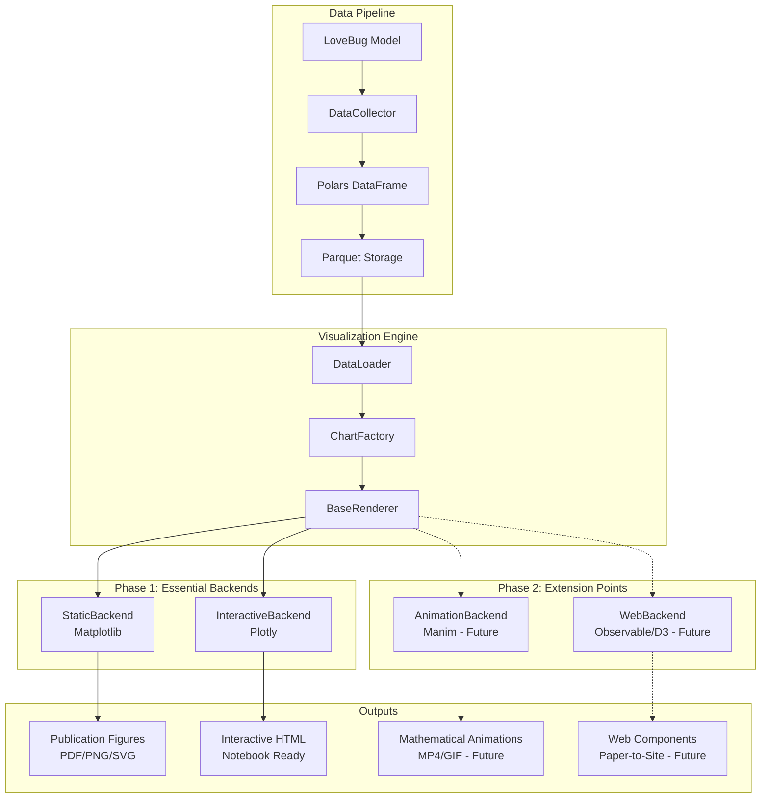

# LoveBug Post-Hoc Visualization Architecture

## Overview

This document outlines the comprehensive post-hoc model visualization architecture for the LoveBug agent-based model. The design prioritizes runtime performance through pre-computed visualizations, supports both publication-quality static outputs and interactive exploration, and provides a modular pipeline for different rendering backends.

## Design Philosophy

- **Post-hoc workflow**: Run simulations first, save comprehensive datasets, then generate visualizations for maximum flexibility
- **Incremental complexity**: Start with essential components (static + interactive), add advanced features (animation + web) later
- **Modular backends**: Different renderers for different output formats while maintaining consistent data processing
- **Academic focus**: Designed specifically for sexual selection research and publication needs

## Core Architecture



## Data Collection System

### DataCollector Integration

The [`DataCollector`](../src/lovebug/visualization/data.py) integrates seamlessly with the existing Mesa-Frames architecture:

```python
class DataCollector:
    """Collects essential metrics during LoveBug model execution"""

    def collect_step_data(self, model: LoveModel) -> Dict[str, Any]:
        """Collect key metrics for one time step"""
        return {
            # Population statistics
            'population_size': len(model.agents),
            'mean_display': model.agents.display.mean(),
            'mean_preference': model.agents.preference.mean(),
            'mean_threshold': model.agents.threshold.mean(),

            # Genetic metrics
            'display_variance': model.agents.display.var(),
            'preference_variance': model.agents.preference.var(),
            'trait_preference_covariance': calculate_covariance(
                model.agents.display, model.agents.preference
            ),

            # Mating success metrics
            'mating_success_rate': calculate_mating_rate(model.agents),
            'assortment_index': calculate_assortment(model.agents),

            # Cultural evolution metrics (Layer 2)
            'cultural_genetic_distance': calculate_cultural_distance(model.agents),
            'social_learning_rate': model.agents.social_learning_rate if hasattr(model.agents, 'social_learning_rate') else 0
        }

    def save_run_data(self, filepath: str) -> None:
        """Save complete run to efficient Parquet format"""
        df = pl.DataFrame(self.data_history)
        df.write_parquet(filepath)
```

### Storage Strategy

- **Format**: Parquet files for efficient columnar storage and fast querying
- **Structure**: One file per simulation run, with metadata header
- **Compression**: Snappy compression for balance of size and speed
- **Indexing**: Time step as primary index for efficient temporal queries

## Chart Types for Sexual Selection Research

### Phase 1: Essential Chart Types

#### 1. TrajectoryChart - Evolutionary Dynamics Over Time

**Purpose**: Visualize core Fisher-Lande-Kirkpatrick dynamics and mechanism interactions

```python
class TrajectoryChart:
    """Time series visualization of evolutionary dynamics"""

    def plot_trait_preference_evolution(self):
        """Mean trait and preference values over time with confidence bands"""
        # Line plots showing parallel evolution or divergence

    def plot_genetic_covariance(self):
        """Evolution of trait-preference genetic correlation"""
        # Single line with critical threshold markers (r = 0, runaway threshold)

    def plot_cultural_vs_genetic(self):
        """Compare cultural and genetic preference evolution"""
        # Dual-axis plot highlighting mechanism dominance

    def plot_population_dynamics(self):
        """Population size effects on evolutionary trajectories"""
        # Multiple lines showing drift vs selection balance
```

**Key visualizations:**
- Trait mean ± standard error over generations
- Preference mean ± standard error over generations
- Genetic covariance trajectory with runaway threshold
- Population size trajectory
- Cultural-genetic preference divergence

#### 2. DistributionChart - Population Patterns and Signatures

**Purpose**: Show population-level patterns that distinguish between mechanisms

```python
class DistributionChart:
    """Population distribution analysis and mechanism signatures"""

    def plot_final_distributions(self):
        """Histograms of trait, preference, and threshold distributions"""
        # Before/after comparisons, multi-modal detection

    def plot_covariance_distributions(self):
        """Distribution of trait-preference covariances across runs"""
        # Key diagnostic for mechanism identification (Paper Figure 2)

    def plot_hamming_similarity(self):
        """Mate choice similarity score distributions"""
        # Central to understanding mate choice mechanics

    def plot_mechanism_signatures(self):
        """Diagnostic patterns that distinguish genetic vs cultural vs mixed"""
        # Statistical fingerprints for mechanism inference
```

**Key visualizations:**
- Final trait distribution histograms (unimodal vs bimodal patterns)
- Covariance distribution shapes (Gaussian vs bimodal vs skewed)
- Hamming similarity score distributions
- Choosiness threshold distributions

#### 3. ComparisonChart - Mechanism Knockout Analysis

**Purpose**: Causal decomposition through controlled mechanism manipulation

```python
class ComparisonChart:
    """Compare different mechanism scenarios and parameter effects"""

    def plot_mechanism_knockout(self):
        """Compare genetic-only vs cultural-only vs combined mechanisms"""
        # Side-by-side trajectory comparisons

    def plot_parameter_sensitivity(self):
        """Effects of varying key parameters (population size, mutation rate, etc.)"""
        # Small multiples or overlay plots

    def plot_time_to_runaway(self):
        """Generations needed for runaway evolution across conditions"""
        # Bar charts with error bars, mechanism comparisons

    def plot_effect_sizes(self):
        """Statistical effect sizes across experimental conditions"""
        # Forest plots showing mechanism contributions
```

**Key visualizations:**
- Side-by-side mechanism comparisons
- Parameter sweep results (small multiples)
- Time-to-runaway bar charts with confidence intervals
- Effect size forest plots with significance indicators

#### 4. HeatmapChart - Parameter Space Exploration

**Purpose**: 2D parameter space visualization and threshold identification

```python
class HeatmapChart:
    """Parameter space heatmaps and threshold identification"""

    def plot_parameter_space(self):
        """2D heatmaps of outcome metrics across parameter combinations"""
        # Population size vs mutation rate, cultural weight vs genetic strength

    def plot_phase_diagrams(self):
        """Parameter regimes where different mechanisms dominate"""
        # Color-coded regions showing mechanism dominance

    def plot_threshold_maps(self):
        """Critical parameter thresholds for different outcomes"""
        # Contour plots showing transition boundaries
```

**Key visualizations:**
- Parameter space heatmaps (population size × mutation rate)
- Mechanism dominance phase diagrams
- Critical threshold contour plots
- Outcome probability surfaces

## Backend Architecture

### Phase 1: Two Essential Backends

#### StaticBackend - Publication Quality

```python
class StaticBackend(BaseBackend):
    """Matplotlib-based high-quality static visualizations"""

    def __init__(self):
        self.style = AcademicStyle()  # Custom publication styling

    def render_chart(self, chart_data, chart_config):
        """Render publication-quality static figure"""
        fig, ax = plt.subplots(figsize=chart_config.figsize)

        # Apply academic styling
        self.style.apply_to_axes(ax)

        # Render chart based on type
        if chart_config.chart_type == 'trajectory':
            self._render_trajectory(ax, chart_data, chart_config)
        elif chart_config.chart_type == 'distribution':
            self._render_distribution(ax, chart_data, chart_config)
        # ... other chart types

        return fig
```

**Features:**
- High-DPI outputs (300+ DPI) for publication
- Custom academic color palettes and styling
- LaTeX integration for mathematical notation
- Multiple export formats (PDF, PNG, SVG)
- Consistent formatting across all chart types

#### InteractiveBackend - Notebook Integration

```python
class InteractiveBackend(BaseBackend):
    """Plotly-based interactive visualizations for notebook environments"""

    def render_chart(self, chart_data, chart_config):
        """Render interactive chart with controls"""

        if chart_config.chart_type == 'trajectory':
            fig = self._create_interactive_trajectory(chart_data, chart_config)
        elif chart_config.chart_type == 'comparison':
            fig = self._create_interactive_comparison(chart_data, chart_config)

        # Add interactive controls
        if chart_config.add_controls:
            fig = self._add_parameter_controls(fig, chart_config)

        return fig
```

**Features:**
- Plotly-based interactive plots
- Parameter sliders and dropdowns
- Zoom, pan, and hover interactions
- Marimo reactive component wrappers
- Jupyter notebook compatibility

### Phase 2: Future Extension Points

#### AnimationBackend - Mathematical Visualizations (Placeholder)

```python
class AnimationBackend(BaseBackend):
    """Future: Manim-based mathematical animations"""

    def render_animation(self, chart_data, animation_config):
        """Create high-quality mathematical animations"""
        # Future implementation with Manim
        # - Evolutionary dynamics animations
        # - Mathematical notation and equations
        # - Professional scientific visualization
        pass
```

#### WebBackend - Paper-to-Website Components (Placeholder)

```python
class WebBackend(BaseBackend):
    """Future: Observable Plot/D3-based web components"""

    def render_web_component(self, chart_data, web_config):
        """Create web-embeddable interactive components"""
        # Future implementation with Observable Plot/D3.js
        # - Web components for paper-to-website transformation
        # - Static site generator integration
        # - Responsive design for mobile/desktop
        pass
```

## File Structure

```
src/lovebug/visualization/
├── __init__.py
├── data.py                 # DataCollector and storage management
├── core.py                 # VisualizationEngine and ChartFactory
├── charts/                 # Chart type implementations
│   ├── __init__.py
│   ├── base.py            # BaseChart abstract class
│   ├── trajectory.py      # TrajectoryChart implementation
│   ├── distribution.py    # DistributionChart implementation
│   ├── comparison.py      # ComparisonChart implementation
│   └── heatmap.py         # HeatmapChart implementation
├── backends/               # Rendering backend implementations
│   ├── __init__.py
│   ├── base.py            # BaseBackend abstract class
│   ├── static.py          # StaticBackend (Matplotlib)
│   ├── interactive.py     # InteractiveBackend (Plotly)
│   ├── animation.py       # AnimationBackend (Future - Manim)
│   └── web.py             # WebBackend (Future - Observable/D3)
├── integrations/           # Platform-specific integrations
│   ├── __init__.py
│   ├── marimo.py          # Marimo reactive components
│   └── jupyter.py         # Jupyter notebook utilities
└── styles/                 # Styling and themes
    ├── __init__.py
    ├── academic.py        # Publication styling
    └── interactive.py     # Notebook styling
```

## Implementation Phases

### Phase 1: Foundation (Weeks 1-2)
**Priority: Essential functionality for immediate research use**

1. **Data Collection System**
   - Implement [`DataCollector`](../src/lovebug/visualization/data.py) with Mesa-Frames integration
   - Set up Parquet-based storage system
   - Create efficient data loading utilities

2. **Core Visualization Engine**
   - Build [`VisualizationEngine`](../src/lovebug/visualization/core.py) and [`ChartFactory`](../src/lovebug/visualization/core.py)
   - Implement [`BaseChart`](../src/lovebug/visualization/charts/base.py) abstract class
   - Create [`BaseBackend`](../src/lovebug/visualization/backends/base.py) system

3. **Essential Chart Types**
   - [`TrajectoryChart`](../src/lovebug/visualization/charts/trajectory.py): Trait-preference coevolution
   - [`DistributionChart`](../src/lovebug/visualization/charts/distribution.py): Population distributions
   - Basic [`ComparisonChart`](../src/lovebug/visualization/charts/comparison.py): Mechanism comparisons

4. **Static Backend**
   - [`StaticBackend`](../src/lovebug/visualization/backends/static.py) with Matplotlib
   - Academic styling and publication-quality outputs
   - PDF/PNG/SVG export capabilities

### Phase 2: Interactive System (Weeks 3-4)
**Priority: Notebook integration and interactive exploration**

1. **Interactive Backend**
   - [`InteractiveBackend`](../src/lovebug/visualization/backends/interactive.py) with Plotly
   - Parameter control widgets
   - Hover interactions and zooming

2. **Marimo Integration**
   - [`MarimoWrapper`](../src/lovebug/visualization/integrations/marimo.py) reactive components
   - Automatic data refresh and reactivity
   - Custom widget integration

3. **Enhanced Chart Types**
   - Interactive [`ComparisonChart`](../src/lovebug/visualization/charts/comparison.py) with parameter sliders
   - [`HeatmapChart`](../src/lovebug/visualization/charts/heatmap.py) for parameter space exploration
   - Dynamic chart type switching

### Phase 3: Advanced Features (Future)
**Priority: Animation and web deployment**

1. **Animation System**
   - Manim integration for mathematical visualizations
   - Temporal dynamics animations
   - Professional scientific animation templates

2. **Web Components**
   - Observable Plot/D3.js integration
   - Paper-to-website transformation pipeline
   - Static site generator compatibility

3. **Performance Optimization**
   - Advanced caching strategies
   - Lazy loading for large datasets
   - Background processing for animations

## Usage Examples

### Basic Usage

```python
from lovebug.visualization import VisualizationEngine

# Load simulation data
engine = VisualizationEngine('data/simulation_results.parquet')

# Create publication-quality trajectory plot
fig = engine.create_chart(
    chart_type='trajectory',
    backend='static',
    config={
        'title': 'Trait-Preference Coevolution',
        'show_confidence_bands': True,
        'export_format': 'pdf'
    }
)
fig.save('figures/trajectory.pdf')

# Create interactive comparison plot
interactive_fig = engine.create_chart(
    chart_type='comparison',
    backend='interactive',
    config={
        'mechanisms': ['genetic_only', 'cultural_only', 'combined'],
        'add_parameter_controls': True
    }
)
interactive_fig.show()
```

### Marimo Notebook Integration

```python
import marimo as mo
from lovebug.visualization.integrations.marimo import LoveBugViz

# Reactive visualization component
viz = LoveBugViz('data/simulation_results.parquet')

# Parameter controls
population_size = mo.ui.slider(100, 10000, value=1000)
mutation_rate = mo.ui.slider(1e-5, 1e-3, value=1e-4)

# Reactive chart that updates with parameter changes
chart = viz.trajectory_chart(
    population_size=population_size.value,
    mutation_rate=mutation_rate.value
)

mo.md(f"""
## Sexual Selection Dynamics
Population Size: {population_size}
Mutation Rate: {mutation_rate}

{chart}
""")
```

## Integration with Academic Paper

The visualization system is designed to seamlessly integrate with the existing academic paper workflow:

1. **Data Collection**: Automatically collect metrics mentioned in the paper (trait-preference covariance, mechanism dominance, population effects)

2. **Figure Generation**: Generate publication-quality figures that match the paper's described results:
   - Figure 1A: Social learning dominance trajectories
   - Figure 2: Trait-preference covariance distributions
   - Parameter sweep visualizations for mechanism comparisons

3. **Interactive Supplements**: Transform static paper figures into interactive web components for online publication

4. **Reproducibility**: All visualizations generated from saved simulation data ensure complete reproducibility

## Performance Considerations

### Data Storage Optimization
- **Parquet format**: ~10x smaller than CSV, faster loading
- **Columnar storage**: Efficient for time series analysis
- **Compression**: Snappy compression for speed/size balance

### Visualization Performance
- **Pre-computation**: Statistical aggregations computed once, cached
- **Lazy loading**: Only load data needed for current visualization
- **Vectorized operations**: Use Polars for efficient data transformations
- **Progressive rendering**: Interactive charts load incrementally

### Memory Management
- **Streaming**: Process large datasets in chunks
- **Garbage collection**: Explicit cleanup of large visualization objects
- **Caching strategy**: LRU cache for frequently accessed data

## Extension Points for Future Development

### Additional Chart Types
- **Network visualizations**: Population structure and mating networks
- **3D visualizations**: Parameter space exploration in higher dimensions
- **Statistical plots**: Regression diagnostics, residual analysis
- **Comparative phylogenetics**: Cross-species comparisons

### Advanced Backends
- **VR/AR visualization**: Immersive parameter space exploration
- **Real-time streaming**: Live visualization during long simulations
- **GPU acceleration**: CUDA-based rendering for large datasets
- **Cloud deployment**: Scalable visualization services

### Integration Platforms
- **Streamlit apps**: Web-based parameter exploration tools
- **Observable notebooks**: Modern web-based scientific computing
- **Shiny applications**: R integration for statistical analysis
- **Custom web portals**: Standalone research dissemination sites

This architecture provides a solid foundation for immediate research needs while maintaining the flexibility to grow with future requirements. The modular design ensures that each component can be developed, tested, and optimized independently while maintaining consistent interfaces and data flow.
